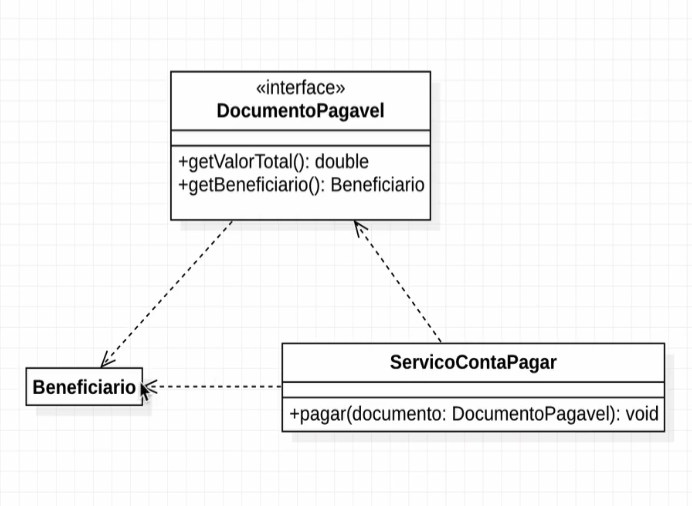
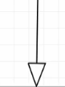
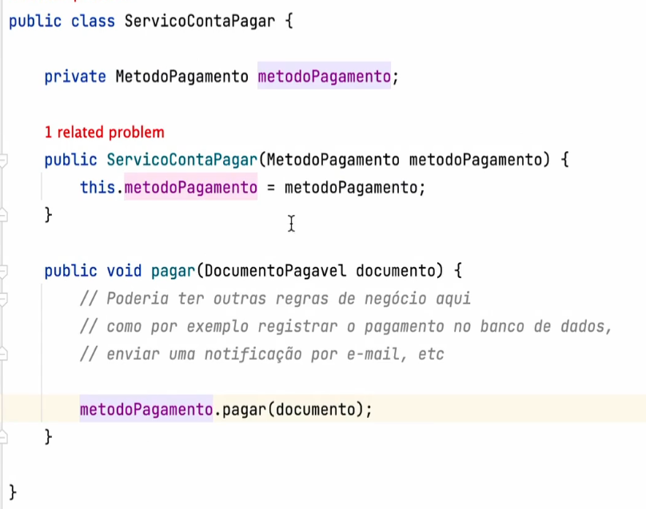
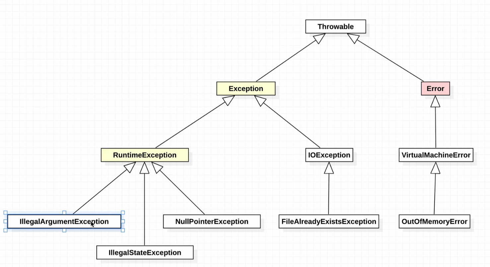

# Resumo *Java*
-tipos primitivos comecam com letra minuscula int boolean char
-tipos primitivos nao admitem null
-classes wrapper: Integer Boolean Character => sao classes que representam os tipos primitivos
- para instanciar um objeto usa se o metodo valueOf
-classes wrapper admitem null e tem metodos uteis
- wrapper significa embrulhar
### tipos de *Wrapper* correspondentes
- int => Integer
- boolean => Boolean
- char => Character
- double => Double
- float => Float
- long => Long
- short => Short
- byte => Byte

### Casting


### Widening Casting (automatically) - converting a smaller type to a larger type size
``byte -> short -> char -> int -> long -> float -> double``

### Narrowing Casting (manually) - converting a larger type to a smaller size type
```double -> float -> long -> int -> char -> short -> byte```

### Casting em classes Wrapper
- faz o casting utilizando metodo .intValue() .doubleValue() .floatValue() .longValue() .shortValue() .byteValue()
- exemplo: Integer i = 10; int x = i.intValue(); // x = 10
- ao comparar variaveis que armazenam objetos com ==, o resultado sera true se as variaveis apontarem para o mesmo objeto. Na classe Wrapper o cache armazena somente numeros de -128 a 127. se passar desses valores, sera criado um novo objeto a cada atribuicao.
- usar .equals() para comparar objetos
- equals compara conteudo e TIPOS! //  == compara referencia
- metodo .CompareTo() => retorna 0 se os 2 numeros forem iguais, -1 se o primeiro numero for menor e 1 se o primeiro numero for maior


### Quando usar Wrappers e quando usar tipos primitivos?
- quando nao for possivel usar tipos primitivos
- quando for necessario usar NULL

### Arrays
- arrays sao objetos
- arrays sao objetos que armazenam varios valores do mesmo tipo
- Array sao MUTAVEIS
- o tamanho do array é FIXO
- Podemos declarar sem inicializar -> int[] numeros;
- mas precisamo INICIALIZAR ANTES DE USAR ou teremos um NullPointerException!
```java
int[] numeros = new int[5]; // declaracao de array, todos os valores sao inicializados com 0 TIPOS PRIMITIVOS
int[] numeros = {1,2,3,4,5}; // declaracao de array com valores 
String numerosString = Arrays.toString(numeros); // transforma o array em uma string
Array.sort(numeros); // ordena o array -> transforma o proprio array CUIDADO!
Integer[] numerosWrapper = {1,2,3,4,5}; // declaracao de array WRAPPER com valores
// para usar o Comparator precisa usar tipos de CLASSE e nao tipos primitivos de array!
Array.sort(numerosWrapper, Comparator.reverseOrder()); // ordena o array decrescente WRAPPER -> transforma o proprio array CUIDADO!

Aluno[] alunos; // declaracao de array de objetos -> com valor null TIPO NAO PRIMitivo -> precisa inicializar antes de usar!
alunos = new Aluno[5]; // inicializacao do array de objetos

```
- para usar sort com nossa propria logica precisamos implementar a interface Comparator
- para criar um array com tamanho DINAMICO precisamos criar uma copia 
- dessa forma o array anterior é descartado pela JVM apos algum tempo.
  - void adicionarAluno(Aluno aluno) {
  this.alunos = Arrays.copyOf(this.alunos, this.alunos.length + 1); // copia o array alunos para um novo array com tamanho maior
  alunos[alunos.length - 1] = aluno; // adiciona o aluno no ultimo indice do array
  }

### recurso varargs
- cria um array do tamanho do numero de argumentos passado na chamada do metodo! 
-exemplo: `ServicoDeComunicacao.enviarEmail("Olá", "segundoArgumentoDoArray", "terceiroArgumentoDoArray");`
- `Tipo...` variavel
- declara um metodo que pode receber um numero variavel de argumentos do mesmo tipo
- exemplo: public void imprimeNumeros(int... numeros) { for (int numero : numeros) { System.out.println(numero); } }
- varargs deve ser o ultimo parametro do metodo, pois ele recebe um numero variavel de argumentos e todo argumento passado apos ele sera considerado parte do varargs.
- varargs aceita argumentos vazios!! != de arrays


# Gerenciamento de Memoria & JVM
- Java Virtual Machine
-Memoria Heap & memoria nao Heap
- memoria heap: onde ficam os objetos
- memoria stack - dentro da NAO HEAP: onde ficam os metodos, variaveis estaticas, etc
- NativeMemoryTracking: ferramenta para monitorar a memoria nao heap


## Pilha de chamadas
- stack trace: pilha de chamadas
- a cada chamada de metodos vamos empilhando um dentro do outro dentro da call stack
- fluxo de Baixo para Cima, empilhando chamada de metodos!
- fluxo de Cima para Baixo, desempilhando chamada de metodos! e ativando o garbage collector, onde variaveis de referencia deixam de existir ao sair do escopo ( metodo desempilhou e nao tem mais referencia para o objeto, logo o objeto pode ser coletado pelo garbage collector)
- o mesmo vale para variaveis do tipo primitivo, porem SEM envolvimento do Garbage colector, pois elas ficam na stack memory e sao liberadas imediatamente ao sair do escopo do metodo
- variaveis do tipo **primitivo** ficam na stack memory
- variaveis do tipo **referencia** ficam na stack memory, **Objetos**!

## Memoria heap com Runtime API
- ``Runtime.getRuntime().maxMemory()`` =>  retorna o maximo de memoria que a JVM pode usar em bytes
- ``.totalMemory()`` => retorna o total de memoria que a JVM esta usando em bytes, reservada no momento! ***.totalMemory()***
- ``freeMemory()`` => Quanto da memoria ja reservada está disponivel na memoria Heap para alocacao de novos oBjetos ***.freeMemory()***
- **memoria em uso no momento**: ``totalMemory() - freeMemory()``

## configurando Memoria Heap
- no consolo digite `java -Xmx1024m Teste` => aumenta o maximo de memoria que a JVM pode usar para 1024 MB ( maxMemory() )
- valor inicial de memoria `java -Xms1024m Teste` => 1024 MB = > util quando o programa requer mais memoria que o valor inicial padrao pela JVM
- liberacao de memoria é feita pelo Garbage collector

## Garbage Collector
- coleta de lixo => identificar objetos que nao estao mais sendo referenciados, e desaloca-los da memoria heap
- Assim que uma variavel de referencia é atribuida como NULL `String teste = "ssss" de teste = null;`, **caso nenhuma variavel esteja usando a variavel teste (declarada antes do teste = null)  e de tempo de o garbage entrar em acao** 
- 

- nao temos garantia de quando o garbage vai rodar!
- **Sytem.gc()** => chama o garbage collector, mas nao temos garantia de que ele vai rodar!
- Garbage Collector é um processo que roda em uma thread separada da JVM
- OutOfMemoryError => significa que nao tem mais espaco para alocar novos objetos

## Memory Leak
- ocorre quando um objeto nao é mais utilizado, mas nao é coletado pelo garbage collector
- no caso da retirada de elemento de uma pilha, o elemento nao é mais utilizado, mas nao é coletado pelo garbage collector, pois a variavel de referencia ainda aponta para ele.
- **boa pratica (Exceção)** = > retirar objetos oBSLETOS que voce notar nao ser observado pelo Garbage com NULL => no exemplo da pilha => array atribuindo NULL, ao remover da pilha.

## inalcançabilidade de objetos
- um objeto é inalcancavel quando nao temos mais referencia para ele
- 1 caso de inalcancabilidade: quando uma variavel de referencia **aponta para NULL**
- 2 caso de inalcancabilidade: quando uma variavel de referencia **aponta para outra variavel de referencia que aponta para NULL**
- 3 caso => apos a execucao do metodo, a variavel de referencia fica inalcancavel( != de deixar de existir) e elegivel para a coleta pelo garbage collector
-4 **ilha de isolamento**=> quando 2 objetos( da Mem Heap) apontam um para o outro, mas nao sao apontados por nenhuma outra variavel de referencia ( da call stack ), logo, sao inalcancaveis e elegiveis para a coleta pelo garbage collector
- 


# Construtores
- construtor é um metodo especial que tem o **mesmo nome da classe** e é responsavel por Inicializar objetos de uma classe
- construtor **nao tem retorno**
- Chamado quando um objeto é criado com a palavra **new**
- Nao tem como chamar construtor como um metodo!! somente na **criacao de um objeto**
- o construtor default em java é o construtor sem argumentos, que nao recebe parametros e nao faz nada

- exemplo 
```java
public class Carro {
    private String marca;
    private String modelo;
    private int ano;
    
    // Construtor default que pode ser alterado!
    public Carro(){} 
        
    // Construtor com parametros
    public Carro(String marca, String modelo, int ano) {
        this.marca = marca;
        this.modelo = modelo;
        this.ano = ano;
    }
    // Sobrecarga de construtores
    public Carron(String marca, String modelo) {
        this.marca = marca;
        this.modelo = modelo;
    }
}
```	
- ao criar um construtor com argumentos, o construtor default deixa de existir
- ao criar construtor privado, NAO se permite a instanciacao da classe -> pratica para criar classes utilitarias,com metodos estaticos.

### Sobrecarga de construtores
- *CUIDADO* Se voce alterar o construtor da classe, todos objetos que instanciam essa classe vao precisar de manutencao! 
- solucao: sobrecarga de construtores -> criar mais de um construtor na classe, *NECESSARIAMENTE* *Com MESMO NOME*  e com diferentes argumentos
- Dependendo de quantos argumentos forem passados ao criar um objeto, o construtor correspondente sera chamado, inclusive o **DEFAULT** => new Carro(); => sem passar argumentos

### Validar Argumentos de Construtores
- é uma **boa pratica** validar os argumentos passados ao construtor, para evitar que o objeto seja criado com valores invalidos
- exemplo: 
```java
public class Carro {
    private String marca;
    private String modelo;
    private int ano;  
    // Construtor com parametros
    public Carro(String marca, String modelo, int ano) {
        Objects.requireNonNull(marca, "Marca nao pode ser nula");
      
        // ou Objects.requireNonNull(modelo, "Modelo nao pode ser nulo");
        if (modelo == null) {
            throw new NullPointerException("Modelo nao pode ser nulo");
        }
        // Objects.requireNonNull(ano, "Ano nao pode ser nulo");
        if (ano < 0) {
            throw new IllegalArgumentException("Ano nao pode ser negativo");
        }
        this.marca = marca;
        this.modelo = modelo;
        this.ano = ano;
    }
   
}

```
### Encadeamento de chamadas de construtores
- É possivel chamar um construtor dentro de outro construtor da ``mesma classe``, utilizando a palavra **``this``** e passando os argumentos necessarios
- ``this`` serve para referenciar a variavel local
- Somente dentro do bloco de outro construtor, podemos chamar outro construtor da mesma classe
- ``this()`` deve ser a primeira instrucao do construtor, pois caso tenha alguma instrucao antes, o compilador vai determinar que o construtor ja esta construido
- *NAO* existe limite para encadeamento de construtores!
```java
public Carro(){ // ao criar um objeto sem passar argumentos esse construtor chama o de baixo passando a string Fiat como Marca.
    this("Fiat");
}
public Carro(String marca){
    Objects.requireNonNull(marca, "Marca nao pode ser nula");
    this.marca = marca;

}
```

### Modificadores final em variaveis de instancia!
- **static final** => variavel de classe constante
- **final** => variavel de instancia constante
    - Ao declarar uma variavel como final, ela nao pode ser alterada depois de inicializada => e Necessita ser inicializada na declaracao **ou no construtor** (*XOR*) => somente em um dos dois | OU um OU outro| !!


- Para inicializar  ao instanciar o objeto, declara-se a variavel como **final** e inicializa-se no construtor
-exemplo
```java
public class ExemploClasse {
    // Variável de instância final
    private final String variavelFinal;

    public ExemploClasse(String valor) {
        // Inicializando a variável final com o valor passado como argumento ao instancia o objeto!
        this.variavelFinal = valor;
    }
```
- **UUID** => identificador unico universal => classe que gera um identificador unico para cada objeto criado
    - UUID.randomUUID().toString() => gera um identificador unico em formato de String
    - utiliza na declaracao de uma variavel final de instancia para gerar um identificador unico para cada objeto criado
    - normalmente declarado no construtor
        ``- this.id = UUID.randomUUID().toString();`` >> fe132e3e-2b1e-4b0e-8b0a-5e0e1e1e1e1e output

### Organizando as classes *Java* em pacotes
- **Convencao de nomes de pacotes** => nomes de pacote em *minusculo*
    - dominio ao contrario =>`` br.com.alura.bytebank``
    - ``com.github.nomeDoUsuario.nomeDoProjeto``
- para criar um pacote ao criar classe voce pode declarar diretamente no nome da classe => `animal.Gato` => com o PONTO . voce cria um pacote dentro de outro pacote
- necessario atribuir no comeco da classe o pacote onde ela esta => class Gato precisa declarar ``package animal``;

### Importando classes de outros pacotes
- para importar uma classe de outro pacote, basta declarar no comeco da classe o pacote onde a classe esta => ``import animal.Gato;``
- para importar todas as classes de um pacote => ``import animal.*;`` o * significa todos.
    - porem é uma **Boa pratica** importar uma por uma, e somente as que voce ira usar!
- ao importar classes com metodos ou construtores private  nao sera possivel acessar esses metodos ou construtores => pois private só pode ser acessado dentro da própria classe em que foi definido.
   

## Modificadores de acesso
- **Boa pratica** -> restringir o acesso a classe e seus membros o MAXIMO possivel quando possivel

### Modificadores de acesso default e public
- **default** => nao precisa declarar, pois é o padrao	
    - Default (ou Package-Private): Se um método ou construtor não tem um modificador de acesso explícito, ele é tratado como default ou package-private. Isso significa que o método ou construtor **pode ser acessado apenas por outras classes no mesmo pacote.**
- **public** => pode ser acessado por qualquer classe
    - Public: Um método ou construtor declarado como public **pode ser acessado por qualquer outra classe**.

### Modificadores de acesso private e protected
- **private** => somente a classe onde foi declarado pode acessar atributos e metodos ou construtores private
    - Private: Um método ou construtor declarado como private **pode ser acessado apenas por outras classes na mesma classe.**
    - ``metodos Public da classe podem acessar metodos private da mesma classe, é a forma de acessar metodos/ atributos com modificadores private!``
- **protected** => somente a classe onde foi declarado pode acessar atributos e metodos ou construtores protected , e **classes filhas ( mesmo em pacotes diferentes)** => ``é um private + classes filhas ``

### importando membros Estaticos
- ``import static`` -> importa membros estaticos de uma classe, **metodos ou atributos**
    - nao precisar chamar pela classe -> como padrão de static 
    - chama-se direto pelo nome do metodo ou atributo
    - exemplo de atributo:
    ```java
    import static java.lang.Math.PI; // importando a constante PI
    system.out.println(PI); // chamando a constante PI
    ```
    - exemplo de metodo:
    ```java
    import static java.lang.Math.random; // importando o metodo random
    system.out.println(random()); // chamando o metodo random
    ```
### Multiplas classes NAO PUBLIC em um mesmo arquivo!
- **Boa pratica** -> criar uma classe por arquivo
- **classe publica** -> OBRIGATORIAMENTE deve ser declarada em um arquivo com seu nome
- Nao deve ser usado, somente em palestras / aulas / exemplos

## Encapsulamento
- A falta de encapsulamento pode levar a problemas de manutencao e seguranca
    - uma classe externa altera o estado de uma classe interna, sem que a classe interna saiba! => **problema de seguranca**
    - Manuntencao: alterar o estado de uma classe interna, pode quebrar o funcionamento de uma classe externa => **problema de manutencao**

- **Encapsulamento** => esconder detalhes de implementacao de uma classe, expondo somente o necessario para que outras classes possam interagir com ela

- Logicas de validacao -> recomendadas ser implementadas nos **metodos de acesso (getters e setters)**

- **Nao se altera assinatura de metodos**, somente o seu funcionamento interno, para nao quebrar o codigo de outras classes que utilizam esse metodo, nao há problema em adicionar atributos ou alterar seus nomes( no caso de eles possuirem getters & setters)
### Tell dont ask
- Regra de classes :  **Tell dont ask**
    - ``Tell`` : Você deve dizer a um objeto o que fazer, chamando um de seus métodos e deixando o objeto cuidar de seu próprio comportamento interno. Isso significa que você confia no objeto para fazer a coisa certa com os dados que ele possui.
    - ``Don't Ask`` : Você não deve perguntar a um objeto sobre seu estado interno e, em seguida, tomar decisões com base nesse estado. Fazer isso viola o encapsulamento, pois expõe os detalhes internos do objeto e transfere a lógica que deveria pertencer ao objeto para fora dele
### JavaBeans e Getter e Setter
- **Convencoes do JavaBeans**:
    - Propriedades Privadas
    - Construtor Sem Argumentos
    - Métodos Getter e Setter
    - Serializável
    - Seguir essas convenções é importante porque **muitas ferramentas e bibliotecas Java dependem delas** para inspecionar e manipular classes de maneira programática
- Getters e Setters -> metodos de acesso
- Getters -> metodo de leitura
- Setters -> metodo de escrita
- Convencao -> getTitulo() e setTitulo() -> **get** e **set** + nome do atributo com a primeira letra maiuscula
-exemplo:
```java
public class Livro {
    private String titulo;
    private boolean emprestado;
   
    public String getTitulo() {
        return titulo;
    }
    public void setTitulo(String titulo) {
        this.titulo = titulo;
    }
    public void isEmprestado() { // convecao para getter de boolean primito
        return emprestado;
    }
}
```
- interface **serializable**:
    - interface que indica que a classe pode ser serializada =>  transformada em um fluxo de bytes para ser transferida! 

### Codigo Limpo -> Lei de Demeter
- sugestao ocasionalmente util -> segundo martin fowler
- train wreck -> chamadas encadeadas de metodos
`metodo1().metodo2().metodo3()`
    - é um anti pattern -> codigo ruim, pois dificulta leitura do codigo e ``aumenta acoplamento``, e qualquer pequena alteracao pode quebrar o codigo.
- ``Lei de Demeter`` -> um objeto deve conhecer o minimo possivel sobre estrutura de outros objetos!
    - Metodo pode chamar outro metodo do proprio objeto!
    - Metodo pode chamar outro Metodo de parametro que recebe!
    - pode chamar metodo de um objeto instanciado dentro do metodo!
    - pode chamar metodos de variaveis de instancias!
- **Boa pratica** -> nao chamar metodos de objetos que foram retornados por outros metodos

### Crie copias defensivas de objetos mutaveis!
- **Boa pratica** -> nao retornar o objeto original, retornar uma copia defensiva dele!
- considerando que a classe é mutavel, ou seja, seus atributos podem ser alterados a qualquer momento -> fazer copias defensivas, instanciando um novo objeto e passando os valores do objeto a ser copiado!
    -exemplo:
    ```java
    public class Agendamento {
        private final Horario horario // o final nao impede que o objeto seja alterado, somente a referencia para ele!
        public Agendamento(Horario horario) {
            this.horario = new Horario(horario.getHora(), horario.getMinuto()); // copia defensiva, criando um novo Objeto Horario e passando os valores do objeto a ser copiado!
        }

        public Horario getHorario() {
            return new Horario(horario.getHora(), horario.getMinuto()); // copia da copia, para nao permitir que o objeto original seja alterado!
        }
    }
    ```
- caso a classe Horario fosse imutavel, com atributos primitivos final, nao seria necessario criar copias defensivas!

### Minimize a **mutabilidade** dos objetos
- ``Classe imutavel`` -> quando os objetos instanciados dessa classe, nao podem ter seus estados alterados depois de instanciado!
- ``Classe mutavel`` -> quando os objetos instanciados dessa classe, podem ter seus estados alterados depois de instanciado!
- **Boa pratica** -> Metodos que recebem objetos como argumentos nao devem alterar o estado desses objetos!
    - Utilizar uma ``classe imutavel`` mitiga esse problema!
-Diretrizes para criar classes imutaveis :
        - ``variaveis de instancia`` devem ser **private e final**
        - NAO ter metodos que alterem o estado do objeto *SETTERS*
        - NAO permitir que a classe seja HERDADA -> ``final`` na declaracao da classe -> `public final class Horario`
- Como não se consegue alterar uma classe imutavel -> solucao é return uma nova instancia da classe, com os valores alterados.`return new Horario(horaAlterada, horario.getMinuto());` // horaAlterada é o novo valor passado como argumento
- **Desvantagem** -> criar uma nova instancia daquele objeto, sempre que precisar alterar o seu valor!
-**Quando Usar** -> Ideal para ``multi-Thread`` e representar valores para tipos de dados abstratos ou `Value Objects` -> objetos que representam valores, como data, hora, CPF, CNPJ, etc. 

### Records
-  RECURSO Lancado no java 16 -> nos ajuda a enxugar o codigo ao criar classes IMUTAVEIS!
- Ao criar a classe imutavel deve-se designar -> `public record NomeClasse(int propriedades){} `
  - No lugar de `class` usamos `record` e coloca-se as propriedades dentro dos parenteses -> que viram os atributos da classe private e final!
  - a classe `record` cria o construtor automaticamente! -> diferente do construtor padrao vazio de classes normais, o construtor do record recebe as propriedades como parametro e inicializa!
    - NAO se pode mudar o nome dos parametros, precisa ser IGUAL ao das propriedades
  - Construtor COMPACTO -> ao criar o construtor da forma -> `public NomeClasse{}` -> o compilador entende que eh um construtor compacto e atribui os parametros as variaveis de instancia automaticamenteo!
    - ```java
      public record NomeClasse(int propriedades){
        public NomeClasse{
            // this.propriedades = propriedades ja esta incluso!
          if(propriedades < 0){
            throw new IllegalArgumentException("Propriedades nao pode ser menor que 0");
          }
        }
        public NomeClasse(int propriedades){ // esse construtor nao precisa ser criado, ja é criado automaticamente!
            this.propriedades = propriedades;
        }
      }
      ```
- **Records** cria automaticamente os Getters, porém com nome igual ao da variavel de instancia -> private final hora -> ao inves de getHora() sera somente *hora()*
  - NAO existem Setters nas classes records -> pois elas sao classes imutaveis, entao nao faz sentido ter setters!
- **Records** tambem implementa toString(), hashCode() e equals() automaticamente 
  -  **toString()** retorna o nome da classe e os valores das variaveis de instancia e **equals()** compara os valores das variaveis de instancia!
  - **hashCode()** -> que retorna um numero inteiro que representa o objeto! 

- na **UML** um record é atribuido com o esteriótipo ``<<dataType>>``

## Herança
- **Heranca** -> mecanismo que permite que uma classe herde ``atributos e metodos`` de outra classe -> classe `pai ` ou `AVô`	
- Java nao permite Heranca multipla -> uma classe pode herdar somente de uma classe
    - **Uma classe filha nao pode ter mais de um pai**
- para isso utiliza interfaces
- **Associacao** é representada por atribuir um atributo a uma classe -> ``private Vendedor nome;`` -> a classe `tem um` atributo do tipo Vendedor, com seta apontando para a classe Vendedor na  UML.
- Herança é um conceito que permite que classes compartilhem atributos e métodos, através da palavra reservada `extends`.
- Usar `tagged classes` NÃO é uma boa pratica! 
  - padrão de design em que uma classe usa um campo para indicar algo sobre o tipo ou estado de um objeto, frequentemente para indicar qual de vários tipos ou comportamentos o objeto deve ter
- a Boa pratica é duplicar classes, cada uma com um comportamento para isolar comportamentos.
- Usa-se *Heranca* para evitar codigo duplicado e para reaproveitar codigo.
    - a herança entre 3 classes podem gerar uma hierarquia, a primeira é pai da segunda, a segunda é pai da terceira. Logo a tercei herda tudo da primeira, inclusive suas associacoes!
  - na *UML* É representado por uma seta com uma ponta vazada -|> APONTANDO PARA CLASSE PAI, chamada de *generalizacao*!
    - pergunta-se "**tal coisa É UM?**" se a resposta for sim, entao é um caso de heranca.
    - NAO utilizar somente para aproveitar codigo e sim para responder a pergunta acima.

- a **HERANCA MULTIPLA nao é permitida no java** -> problema do diamante 
  - Resolvee-se com interfaces -> uma classe pode implementar varias interfaces, mas somente herdar de uma classe!
- **Atributos private** `SOMENTE NA PROPRIA CLASSE`nao podem ser acessados INCLUSIVE por classes filhas, somente por metodos get e set.
- **Atributos protected** podem ser acessados **POR classes filhas** Independente do pacote que essa filha estiver E TAMBEM por outras classes que estiverem no mesmo pacote, sem estar vinculadas( Heranca. ).
- **Atributos public** `POR TUDO E TODOS ` podem ser acessados por classes filhas e por classes de outros pacotes -> ``CUIDADO``!

- em ``Heranca`` -> usar tipos `Protected` em metodos e `private em atributos` -> setAtributo(); , para que somente classes filhas e no mesmo pacote possam acessar os atributos!

- **ao SOBREESCREVER metodos** -> conseguimos mudar a assinatura do metodo, mas nao o tipo de retorno! 
    - conseguimos mudar o modificador de acesso de protected ( classse PAI ) para Public na clase filha! (EXPANSAO DE ACESSO)
    - mas NAO CONSEGUIMOS mudar de protected para private! ( REDUCAO DE ACESSO )

- **@override** -> anotacao que indica que o metodo foi sobrescrito, e nao é um novo metodo! , sobrecarga de metodos nao usa anotacao override, nao utiliza nenhuma anotacao.

- Para ``chamar o metodo da classe pai``, utiliza a sintaxe ``super``.metodo(); -> ao inves de usar o metodo sobreescrito da classe filha, chama o da classe pai.
    - utiliza o super para realizar ``ESPECIALIZACAO`` do metodo, ou seja, chama o metodo da classe pai, e depois executa o restante do metodo na classe filha( se houver).

- Toda Classe em Java extends ``Object``, ou seja, herda de Object -> IMPLICITAMENTE
- Ao instanciar uma classe filha, todos CONSTRUTORES  Das classes da hierarquia serão chamados em ordem, filha para pais. 
- todos construtores da hierarquia, ja tem o super() implicito, chamando o construtor da classe pai, caso nao seja explicito. e precisa ser a PRIMEIRA INSTRUCAO, da mesma forma que o this para chamar outro construtor da mesma classe.
- **Boa pratica** -> sempre que possivel, criar construtores **SEM** argumentos(podemos usar o this nele para chamar outros constructors da classe), e nao usar o construtor padrao vazio, pois ele pode ser chamado por engano. 
- TAMBEM ``PODEMOS passar os argumentos dentro do super()`` -> super(argumentos); -> para chamar o construtor da classe pai com argumentos.

- **Boa pratica** -> Sempre sobreescrever o metodo toString() de Object -> para que o estao do objeto seja representado e  impresso de forma legivel, e nao o endereco de memoria.
- System.out.println(objeto); -> chama o metodo toString() do objeto, que por padrao imprime o endereco de memoria.
- implementar o metodo toString para praticas de Logging SOMENTE.
- um **record** ja implementa o metodo toString() automaticamente, retornando o nome da classe e os valores das variaveis de instancia.
    - exemplo:

    ```java
    @Override
    public String toString() {
        return "Nome: " + this.nome + " CPF: " + this.cpf + " Salario: " + this.salario;
    }
    ```
- utilizar o ``modificador final em metodos`` de classes PAI, para que nao possam ser sobrescritos por classes filhas, para garantir segurança e impedir modificacoes de comportamento.
```java	
public final void metodoFinal() {
    System.out.println("Executando metodo final");
}
```
- **boa pratica** -> evitar sobreposicoes multiplas! usar o final no metodo que deseja cortar a permissao de override pela filha da mesma.

- **Cuidado** -> Metodos que chamam outros metodos podem gerar comportamentos inesperados `se um método na classe pai chama outro método e você sobrescreve esse "outro método" na classe filha, a versão sobrescrita na classe filha será chamada, mesmo quando o método da classe pai é invocado.`


### Equals()
- o == compara se as variaveis de referencia apontam para o mesmo objeto
- se nao sobreescrevermos o equals ele vai comparar se as variaveis de referencia apontam para o mesmo objeto
- ideal: 
- o equals() comparar o conteudo dos objetos, ou seja, o valor dos atributos
- **Boa pratica** -> sempre que sobrescrever o equals() sobrescrever o hashCode() tambem!
- **Contrato do override em Equals** -> **5 REGRAS**
    - ``Reflexivo``: x.equals(x) deve retornar true para qualquer x diferente de null
    - ``Simétrico``: para qualquer x e y diferentes de null, se x.equals(y) == true, então y.equals(x) == true
    - ``Transitividade``: para quaisquer x, y e z diferentes de null, se x.equals(y) == true e y.equals(z) == true, então x.equals(z) == true
    - ``Consistente``: para quaisquer x e y diferentes de null, múltiplas invocações de x.equals(y) devem retornar o mesmo valor
    - ``Para qualquer x diferente de null``, ``x.equals(null) deve retornar false``

### Upcasting de Referencias
- **Upcasting** -> ``NAO É conversao, somente mudamos a forma de enxergar`` conversão implicita de uma referencia de uma classe filha para uma classe pai -> Enxergar a classe filha como a classe Pai
- restringe quais métodos e propriedades da instância são acessíveis, limitando-os aos que são declarados na classe Conta.
- o Upcasting Generaliza a classe -> Restringe a chamada de métodos, especializadas na classe filha. Mas nao pode ser chamada na classe pai.
- ``Tipo de uso``: Promocao de tipo de usuario, usuarioNormal -> usuarioAdmin
    - Ao realizar o upcasting, somente os metodos da classe Pai podem ser chamados.
- **CUIDADO** -> ``Se a classe filha (contaEspecial) sobrescreveu um método da classe pai (Conta), então a versão sobrescrita do método é a que será chamada``

    -  `Conta conta = (Conta) contaEspecial;` -> conversao explicita de uma referencia de uma classe filha para uma classe pai
    - em ``TEMPO DE EXECUCAO -> contaEspecial é do tipo contaEspecial // FILHA É FILHA``, mas a referencia é do tipo Conta
    - em ``TEMPO DE COMPILACAO`` -> contaEspecial é do tipo Conta ( ``FILHA é PAI``)
    - ``O objeto apenas é enxergado como Pai, mas na memoria e na referencia ele nao sofre alteracao.``

    - ``GETCLASS()`` -> ao usar o .getclass() apos o upcasting -> retorna o tipo da classe filha para conta e para contaEspecial, pois o upcasting nao altera o tipo do objeto, somente a forma de enxergar.
    - em ``casting de objetos NAO SE PERDE PRECISAO`` como o cast de tipos primitivos -> o compilador passa a enxergar o objeto como um SUPERTIPO.
    - `tipoPai referencia = new tipoFilha();`

- Upcasting IMPLICITO -> se a classe for filha da que queremos Upcasting, basta fazer : contaEspecial é filha de Conta! 
```java	
// atribuicao implicita
Conta conta =  new contaEspecial(); // upcasting implicito
```
- **PRINCIPAIS PONTOS** se você fizer o upcasting como no seu exemplo, ao chamar um método através da referência conta, o Java irá:
- `` 1- Chamar o método da classe Conta, se não houver uma versão sobreescrita na classe contaEspecial.``
- `` 2- Chamar a versão sobreescrita do método na classe contaEspecial, se ela existir.``
- `` 3- Os métodos exclusivos(NOVOS) da classe contaEspecial (que não estão na classe Conta) não serão acessíveis através da referência conta.  Em outras palavras, o polimorfismo em Java garante que a versão mais específica (ou sobrescrita) do método seja usada.``

### POLIMORFISMO 
- ``Definicao``: `é a capidade de um objeto ser enxergado de diferentes formas`
- ``Para resolver o problema de como passar parametros de tipos diferentes no mesmo metodo, usamos o polimorfismo. Para evitar a sobrecarga excessiva de metodos.``
- Aproveitar o mesmo metodo para tipos de diferentes de classes ( argumentos passados ao metodo)
- Quando extendemos uma classe -> nao perdemos a compatiblidade com a superclasse -> ``podemos passar uma instancia da classe filha como argumento para um metodo que recebe a classe pai como argumento.Assim ao passar um argumento da classe filha o upcasting implico é feito``
- Usar Parametros de supertipos para aumentar a flexibilidade do seu Metodo.
    - Ou SEJA -> escolher o tipo de parametros de metodos de acordo com a restricao/ liberdade ao passar argumentos.
    - **IMPORTANTE** ->`` O upcasting implicito de argumento Resulta em diferentes comportamentos dependendo do objeto filho passado como argumento. Pois ele ira usar as classes Sobreescritas especificas em tempo de execucao.``
    - ```java
            public void deposita(ClassePai valor) 
                this.saldo += valor;
    ```

### DowncCasting de Referencias
- Frase : `"Não se pode tratar um Pai como um Filho , mas se pode tratar um Filho como um Pai."`

- Ir contra a SETA DA HIERARQUIA 
- **Evitar o MAXIMO POSSIVEL USAR DOWNCASTING**
- **Downcasting** -> conversao EXPLICITA de uma referencia de uma classe pai para uma classe filha
- Para Especializar os metodos da classe pai, e chamar os metodos da classe filha.
- Tornar a ``visualizacao do objeto MAIS ESPECIFICA``
- ````java
    Conta conta = new Conta();
    // Conta é PAI de ContaEspecial
    ContaEspecial contaEspecial = (ContaEspecial) conta; // downcasting explicito
    ````
- Recomendavel ``Validar o casting antes de usar``, Principalmente DownCasting.

### Operador Instanceof
- `` Utilizado para validacao ao fazer o downCasting!``
- Tentar **evitar** usar ele, mas caso necessario, usar com cuidado!
- `Conta instaceof(É UM) ContaEspecial` -> retorna true se o objeto for do tipo da classe ou de uma classe filha
 - ` TRUE se conta é uma ContaEspecial OU uma classe ABAIXO  dela na Hierarquia ( FILHAS ). se conta for uma classe acima dela na hierarquia ( PAI ) retorna FALSE.` 
- usar para Comparar se é da MESMA OU FILHA! -> TRUE
- usar para Comparar se é da MESMA OU PAI! -> FALSE
- Serve para fazer uma comparacao Logica para saber se o argumento passado é do tipo da classe que queremos OU FILHA .
- Evita A excecao em tempo de execucao de ClassCastException ao tentar o DownCasting 
```Java
Public void deposita(Conta conta){
    // Se o parametro contaInstancia for do tipo ContaEspecial ou filha, entao faz o downcasting!!
    // 
    if(contaInstancia instanceof ContaEspecial){
        // Verdadeiro DownCasting
        ContaEspecial contaEspecial = (ContaEspecial) contaInstancia;
        contaEspecial.deposita(100);
    }
}
```
- a partir do java 16 podemos usar o ``Pattern Matching`` para fazer o downcasting
```java
    if(conta instanceof ContaEspecial contaEspecial){
        // ContaEspecial contaEspecial = (ContaEspecial) conta; JA FOI FEITO
        contaEspecial.deposita(100);
    }
```
- **CUIDADO** -> Não recomendado usar o instaceof! 
-*Formas de Evitar usa-lo*: ``Sobrecarga de metodos // Metodos Principais na classe Pai -> para usar sobreescrita nas filhas -> polimorfismo`` 
- ``JVM escolhera o metodo mais especifico para o tipo de argumento passado. Vai de Baixo para cima na hierarquia.``
- Em classes Filhas nas quais voce nao tem acesso ao codigo fonte para adicionar novos Metodos, voce pode usar o instanceof para fazer o downcasting e chamar os metodos da classe filha.

### Classes Abstratas
- Classes abstract nao precisam ter metodos abstratos. Somente se for necessario.
- Classes que nao fazem sentido em ser instaciadas -> por ser algo muito abstrato.
- Ideal para reutilizar codigo, e evitar duplicacao de codigo.
- Beneficios do Polimorfismo contam!
- Na mesma hierarquia se pode ter mais de uma classe abstract, mas no minimo as classes folhas devem ser concretas, ou nao faz sentido.
-  Utilizar ``abstract`` para Impedir que uma classe seja instanciada, Somente herdada.
    - ``é somente um conceito abstrato, nao desejamos que vire concreto.``
    - na UML sao representadas com a tag <<abstract>> na classe ou Italico
    ```Java
    public abstract class Conta 
    }
    ```
-  ``Metodos abstratos`` -> Declarados na classe abstrata(Pai) e **força** a classe filha a implementa-lo ( A nao ser que a filha tambem seja uma abstract, nesse caso a classe filha (concreta) Folha sera a obrigada a implementar), obrigatoriamente.`
```Java
public abstract void metodoAbstrato();
```
- Podemos implementar Novos Metodos abstratos, Nao que precisemos declarar todos os metodos na primeira classe abstrata, podemos ir implementando novos metodos abstratos nas classes filhas. 
- em Java, o tipo de retorno de um método abstrato não pode ser alterado quando você o sobrescreve em uma subclasse.
- **IMPORTANTE** ``uma classe concreta (folha) na base da hierarquia de herança é responsável por implementar todos os métodos abstratos que não foram implementados em qualquer ponto na cadeia de herança.``

### Interfaces
- Sintaxe para usar a interface -> ``public class ClasseConcreta implements ClasseInterface{}``
- Por que usar as ``interfaces`` no lugar das ``abstracts``? Nivel de abstracao das inferfaces é um nivel de abstração ainda maior que as classes abstratas. 
- Outro motivo:`` Uma classe pode implementar varias interfaces, mas somente herdar de uma classe.``

- ``Interface`` -> é um contrato, que a classe que implementa-la deve cumprir.  A interface dita a regra e a que implements ela assina o papel. 
- Nao se pode mudar a interface, pois quebraria o codigo de todas as classes que a implementam.
    - Exemplo: alterar o padrao/contrato/interface da exposicao das marchas do carro -> confundiria todos os motoristas. 
- `` Interface: Diz O QUE  deve fazer, e nao COMO.``
- ``Interface`` -> nao tem atributos, somente CONSTANTES e métodos abstratos. `public static final ja é IMPLICITO ao declarar qualquer variavel. Precisam ser atribuidas valores na declaracao`
- Assim como abstract classes, interfaces nao podem ser instanciadas.
```Java
public interface ClasseInterface {
    //public static final int CONSTANTE = 1; IMPLICITO

    //public static final ja é implicito em atributos de interfaces
    int CONSTANTE = 1;
    public abstract void metodo();
    // o public abstract ja esta implicito em metodos de interfaces
    void metodo2(); // IMPLICITO
}
```
- `Caso nao coloquemo public abstract na declaracao do metodo, o compilador coloca implicitamente em INTERFACES`
- ``Interfaces potencializam o Polimorfismo`` ao seu nivel MAXIMO!
- ``Interfaces`` -> nao podem ser instanciadas, somente implementadas por classes concretas.
-  É possivel implementar os metodos abstratos na propria interface a partir do java 8, mas nao é uma boa pratica. 
- 
- Classe Servico conta Usa instancias das classes documentoPagavel e Beneficiario, Isso explica as setas apontando (seta tracejada com triangulo vazio)  de Servico para essas duas classes(Associacoes normais). Ja heranca(Seta inteira com trinagulo vazio) seria a seta -|>
- Herança :  
- Interface: - - - -|>
- ``Servico Conta Pagar TEM UM DocumentoPagavel e TEM UM Beneficiario, pois sao atributos da classe ServicoContaPagar.``
- Quando voce implementa uma classe, ``nos argumentos do tipo da interfaces``, voce pode passar qualquer classe que implemente essa interface, pois ela cumpre o contrato da interface. Realiza um upcasting implicito nesses parametros.
- Usar interfaces para definir os TIPOS PASSADOS POR PARAMETRO, para aumentar a flexibilidade do seu metodo. BAIXO ACOPLAMENTO.Quanto mais imports, mais acoplamento. exemplo: 
- a classe que tem metodos com tipos de parametros da interface nao necessariamente implementa a interface, somente as classes que serao passadas como argumento implementam a interface.


- Nesse exemplo: As classes Pix e Transferencia implementam MetodoPagamento, ServicoContaPagar Recebe no construtor a instancia de Pix ou de Transferencia (Pois o tipo MetodoPagamento 
é somente a interface dos dois, para garantir a flexibilidade do metodo). 
```Java
public void metodo(ClasseInterface classeInterface){
     classeInterface.metodo();
}
```
- Injecao de dependencias -> quem vai dizer qual é o metodo a ser chamado é a classe que implementa a interface.

### Boas Práticas em interface e Herança
- a Rigidez da Herança é solucionada com interfaces, facilita o acrescimo de funcionalidades do seu sistema. Manutenção e evolução.	
- Prefira Composicao x Heranca de classes -> effective java
-composicao -> Tem um -> basta uma classe ter um atributo de outra classe
- Heranca - É um -> a classe tem que extends outra
    - qualquer alteracao na super classe resulta em alteracoes no funcionamento das sub classes
- Para a flexibilidade ser alta, criamos associacoes da classe com uma interface e esta interface é implementada por N classes. Assim a classe TEM UM atributo do tipo da interface.
- Fica mais facil de testar as pequenas partes e ver se tal metodo é chamado.
- Evitar criar ``default methods em interfaces``, pois pode quebrar o codigo de todas as classes que implementam a interface.
    - para corrigir, sobrescrever o metodo default na classe que implementa a interface.
- ``NAO```` implementar interfaces`` ``somente`` ``para usar constantes!`` -> Ao implementar uma interface, a classe herda as constantes da interface!
    - caso ache que as constantes sao muito relacionadas a classe, entao crie a classe com as proprias constantes.
    - caso nao ache uma forte relacao, faca a importacao estatica das constantes da CLASSE FINAL com construtores PRIVADOS (nao pode ser herdada nem instanciada). -> classeFinal.constante

- `Referencie objetos por suas interfaces` -> usar o tipo mais abstrato(interfaces) ao passar os argumentos para os metodos `public ClasseInterface finalizar(ClasseInterface classeInterface){}`  
- dar prioridade a passar INTERFACES nos retornos de metodos e nos argumentos de metodos.
- Dar prioridade ao criar novas instancias, declarar variaveis com tipo da interface, ao inves de criar com o tipo da classe concreta. `ClasseInterface novoObjeto = new ClasseConcreta();`
    - Somente usar a classe concreta na Instanciacao! como o exemplo acima.
    - Dessa maneira, para trocar o tipo de objeto, basta trocar a classe concreta na instanciação, sem alterar o codigo que usa o objeto. 


### delegacao de metodos
- delegar metodos de uma classe para outra classe 
- a classe passada como argumento no construtor, é a classe que vai realizar o trabalho, e a classe que recebe a instancia dessa classe, vai delegar o trabalho para ela.
```java
public class ContaDecorator {
    private final ContaEspecial contaEspecial;
    public Conta(ContaEspecial contaEspecial) {
        this.contaEspecial = contaEspecial;
    }
    public double getSaldo() {
        return contaEspecial.getSaldo();
    }
    public void deposita(double valor) {
        contaEspecial.deposita(valor);
    }
}
```
### Decorator Pattern
- Padrao que recebe uma classe no construtor e Embrulha ela usando os Delegates para realizar o trabalho.
- sintaxe: classeDecorator
- Decorator -> é uma classe que recebe uma instancia de outra classe no construtor e delega os metodos para ela.


## Excecoes
- ``Excecoes`` -> sao erros que ocorrem em tempo de execucao, que podem ser tratados.
- IllegalArgumentException -> excecao de argumento invalido -> exceptions sao objetos e devem ser instanciados
```java
IllegalArgumentException exception = new IllegalArgumentException("Argumento invalido");
throw exception;
// Para nao precisarmos instanciar antes de lancar USAMOS
throw new IllegalArgumentException("Argumento invalido");
```
- A excecao para o fluxo de execucao e vai para a classe MAIN ou para bloco catch, e procura um tratamento. se nao houver o bloco catch para TRATAMENTO, o programa para de executar.

- IllegalStateException -> excecao de estado invalido -> quando o estado do objeto nao permite a execucao do metodo.

- NullPointerException -> excecao de referencia nula -> quando o objeto nao foi instanciado e tentamos acessar um metodo ou atributo dele.
    - Objects.requireNonNull(objeto, "Mensagem de erro"); -> verifica se o objeto é nulo, se for, lanca a excecao com a mensagem de erro.
        - O mesmo que o if que checa a nulidade.
- ``Quando uma excecao é lancada. o fluxo de controle da Call stack vai para o metodo anterior, e assim por diante, ate chegar na classe main, se nao houver tratamento ou captura, o programa para de executar.``
- Stacktrace -> rastro de execucao, mostra o caminho que o fluxo de execucao percorreu ate chegar na excecao.
    - Fica em vermelho no console.
### Try Catch 
- ``Try Catch`` -> bloco de codigo que tenta executar o codigo dentro do bloco try, e caso ocorra uma excecao, o fluxo de execucao vai para o bloco catch, que captura a excecao e trata.
```java
try {
    // codigo que pode lancar uma excecao
    // abaixo -> catch com TIpo de excecao que queremos capturar
} catch (Exception e) {
    // tratamento da excecao
    // toda excecao tem uma mensagem, que pode ser acessada com e.getMessage()
    system.out.println(e.getMessage());
}
```
- caso o codigo dentro do try lance exececao, o fluxo de execucao vai para o catch( Ao contrario de ir para o metodo abaixo na call stack)  e fazemos o tratamento da excecao, e depois continua a execucao do codigo normalmente.
    - depois do tratamento o fluxo de execucao continua normalmente, como se nada de errado tivesse acontecido.  
- ` Onde na pilha de chamada usar o TRY CATCH?`
    - Não tem uma regra, depende do contexto. Olhar se o método tem como tratar a exceção( tem informações suficientes), se não tiver, passar para o método que o chamou, e assim por diante. 
- Dentro do bloco ``CATCH`` -> devemos tentar corrigir o problema, ou lancar uma nova excecao. Caso nao seja possivel devemos registrar o erro em um log.
- `PrintStackTrace()` -> imprime o rastro de execucao da excecao, para sabermos onde ocorreu o erro.
    - Ele nao imprimre na saida padrao, Imprime na saida de Erro. System.err
- Multiplos Catchs -> podemos ter varios catch no mesmo try para tratar excecoes diferentes. Exemplo:
```java 
try {
    // codigo que pode lancar uma excecao
    // abaixo -> catch com TIpo de excecao que queremos capturar
} catch (Exception e) {
  
    system.out.println(e.getMessage());
} catch (NullPointerException e) {
   
    system.out.println(e.getMessage());

}
```
### Hierarquia de Excecoes

- ``IllegalArgumentException -> RuntimeException -> Exception -> Throwable -> Object``
- Diferente de Dart, so se pode capturar classes que sao FILHAS  de `Throwable` -> `Exception` e `Error`
#### Unchecked Exceptions
-`` Herdou RunTimeException -> É Uncheckd Exception -> nao obriga a captura ou tratamento``.
- Excecoes que ``nao obrigam a captura ou tratamento``, pois sao excecoes que nao podem ser previstas, como erros de programacao.
- Sempre que uma ``excecao herdar RuntimeException, ela sera uma excecao nao checada``.

#### Checked Exceptions
- ``Nao herdou RunTimeException / Herda somente Exception -> É Checked Exception -> obriga a captura ou tratamento`` OU PROPAGAR ``TRHOW`` PRO METODO CHAMADOR.
- Excecoes que ``obrigam a captura ou tratamento``, pois sao excecoes que podem ser previstas, como erros de usuario.

#### Error
- No geral nao se captura nem trata Errors.
- São erros que ocorrem em tempo de execucao, que nao podem ser tratados, como erros de hardware, ou erros de programacao. OutOfMemoryError, StackOverflowError, VirtualMachineError etc.

### Capturando Checked Exceptions
- Classe Path -> representa um caminho de arquivo ou diretorio no sistema de arquivos.
    - Path path = Paths.of("/Users/Diretorio/teste.txt "); -> cria um objeto Path com o caminho do arquivo.
    - Files.createFile(path); -> cria o arquivo no caminho especificado.
    - Caso voce declare o arquivo dentro do try, ele so vai existir dentro do try, entao nao sera possivel acessar o arquivo fora do try. Como fizemos abaixo:
    ```java
    // faca um tratamento para a excecao checked IOException
    Path path = Paths.of("/Users/Diretorio/teste.txt ");
    try {
        Files.createFile(path);
    } catch (IOException e) {
        System.out.println("Erro ao criar o arquivo: "e.getMessage());
        e.printStackTrace();
    }
    System.out.println(path);
    ```
### Excecoes Customizadas
- Criar uma ``classe que herda  RuntimeException``, para criar uma excecao customizada.
```java
public class SaldoInsuficienteException extends RuntimeException {
    public SaldoInsuficienteException(String message) {
        super(message);
    }
}
```
- Assim podemos usar o throw new SaldoInsuficienteException("Mensagem de erro"); para lancar a excecao.
- ``Boa pratica`` -> criar uma classe de excecao para cada tipo de excecao que voce quer lancar, para que o tratamento seja mais especifico.
#### Variaveis de instancia em excecoes customizadas
- Podemos criar variaveis de instancia na classe de excecao, para passar informacoes mais especificas sobre a excecao. 
- Assim temos que passar essas informacoes no construtor da classe quando usarmos o throw new SaldoInsuficienteException("Mensagem de erro", this.saldoAtual, this.valorSaque);
```java
public class SaldoInsuficienteException extends RuntimeException {
    private final double saldoAtual;
    private final double valorSaque;

    public SaldoInsuficienteException(String message, double saldoAtual, double valorSaque) {
        super(message);
        this.saldoAtual = saldoAtual;
        this.valorSaque = valorSaque;
    }

    public double getSaldoAtual() {
        return saldoAtual;
    }

    public double getValorSaque() {
        return valorSaque;
    }
}
```
#### Herdando CheckedExceptions
- ``Herdando Exception`` -> Checked Exception -> obriga a captura ou tratamento.
- Nao faz sentido capturar a excecao no proprio codigo que a lancou, entao devemos propagar a excecao para o metodo que chamou o metodo que lancou a excecao.
- ``Propagar a excecao`` -> usar a palavra reservada ``throws`` no metodo que lanca a excecao.
- Assim propaga a excecao para frente da call stack e quem chamar o metodo deve tratar.
- ``Ou trata com catch ou propaga pra frente com o throws.``
```java
// Sempre que ocorrer uma excecao com o metodo, ele nao vai tratar, vai propagar a excecao para o metodo que o chamou, e assim por diante.
// SE LE -> o metodo() pode lancar a excecao SaldoInsuficienteException
public void metodo() throws SaldoInsuficienteException {
    // codigo que pode lancar uma excecao
    throw new SaldoInsuficienteException("Saldo insuficiente", this.saldoAtual, this.valorSaque);
}
public void metodo2() {
    try {
        metodo();
    } catch (SaldoInsuficienteException e) {
        System.out.println(e.getMessage());
    }
}
```
- ``Boa pratica`` -> `LANCAR a excecao o MAIS CEDO POSSIVEL`, no nivel mais baixo da pilha de chamada. BAIXO NIVEL
- ``Boa pratica`` -> `CAPTURAR a excecao o MAIS TARDE POSSIVEL`, no nivel mais alto da pilha de chamada. Mas nao quer dizer sempre no metodo main. ALTO NIVEL


